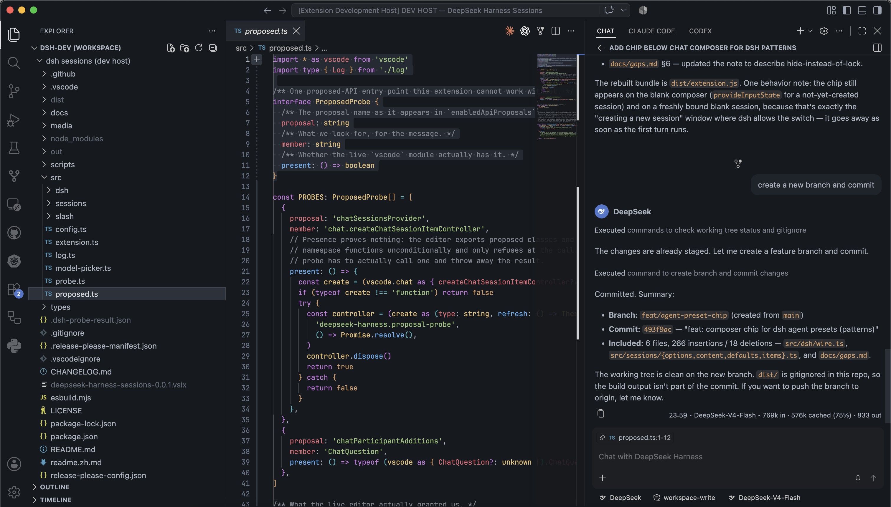

# vscode-deepseek-harness

[中文文档](readme.zh.md) · [English](README.md)

> [!WARNING]
> **Breaking change since v0.0.8:** the extension will no longer start a DSH process automatically. You must launch and manage DSH yourself—for example, run `dsh web` in an external terminal or as a service you manage. The extension will only attach to the server at `deepseekHarness.url` (default: `http://127.0.0.1:3080`). Once DSH is running, use **DeepSeek Harness: Reconnect** if the extension has stopped retrying.

An unofficial VS Code extension that registers [DeepSeek Harness](https://github.com/deepseek-ai/deepseek-harness) as a **chat session target** in VS Code's native agent sessions view — the same surface that hosts Claude Code and Codex — rather than shipping another webview chat panel.

Status: **M0–M5 implemented.** A VSIX builds, installs and activates with its proposed APIs granted.



- [docs/plans/0001-vscode-chat-session-provider.md](docs/plans/0001-vscode-chat-session-provider.md) — architecture decision, API mapping, and milestones.
- [docs/gaps.md](docs/gaps.md) — what the chat UI wanted, what `/api` could not give it, and what was done instead.

## Using it

**dsh answers in the same chat panel Copilot does.** There is no second sidebar and no webview: the panel above is VS Code's own, and the reply in it came from the `dsh` on this machine.

Which agent answers is a picker at the bottom of the composer, reading **Local** in a default install. Click it and choose **DeepSeek Harness** — from then on, everything you type in that chat goes to your harness. The chip stays until you change it, so this is a per-conversation choice rather than a mode.

Once you are on it, the composer is the ordinary one, and the parts of it that matter here are:

| In the composer | What reaches dsh |
|---|---|
| Your editor selection, pinned as a chip | The file, the line range, and the selected lines themselves |
| A file dragged in, or `#`-referenced | Its path, relative to the session's working directory |
| A pasted image | A real image attachment, when the model accepts one |
| A `/`-line naming a command dsh owns | The command, executed through dsh's own registry — never sent to the model |
| **Model** picker | `session.selectModel` — every provider and model your dsh advertises |
| **Reasoning** picker | The efforts of the selected model, with that model's own default |
| **Permissions** picker | `read-only` / `workspace-write` / `danger-full-access`, whatever your dsh's preset table holds |

A selection is sent as text because dsh has no structured reference type; a saved file is sent as a path, because dsh has its own read tools and would rather open it than be handed it. Both decisions, and their cost, are in [gaps §10](docs/gaps.md).

The **SESSIONS** list on the right is your real dsh session history — the same sessions the `dsh` web UI shows, because it is the same harness. Opening one rebuilds its transcript; **New Session** starts one in your workspace folder.

## What it does

| | |
|---|---|
| Sessions list | Your real dsh sessions, live: added, removed, running, and blocked-on-you |
| Transcript | Past turns rebuilt from the session log, with tool cards |
| Live turns | Prose, reasoning, and tool calls streaming as they happen |
| Questions | Answered inline in the chat, blocking exactly as dsh's `ask()` does |
| Approvals | Same, as an *Allow once* / *Reject* prompt |
| Attachments | Your selection with its line range, dropped files, `#`-references, pasted images |
| Model switch | Every provider and model your dsh advertises, read fresh per session |
| Thinking effort | The reasoning efforts of the selected model, with its own default |
| Permissions | The session's preset, switched through dsh's own `/permission` command |
| Slash commands | dsh's own `plan`, `compact`, `feedback`, `export`, `permission`, `goal` — proxied from the composer and the Command Palette, never sent to the model |
| Token usage | Per turn, prompt and completion, with the cache read/write split |
| Context | Percent of the model's window on each session row |
| Control | Stop, fork from a chosen turn, new session in your workspace folder |
| Model switch by command | `/models` in the composer (or **Switch Model…** in the Command Palette) opens dsh's own catalog |

Nothing in that table is hardcoded. Providers, models, reasoning efforts, titles, token counts and context capacity are all read from the running harness, so a model your dsh gains tomorrow appears without an update here.

## Slash commands

dsh's own slash commands — `/plan`, `/compact`, `/feedback`, `/export`, `/permission`, `/goal`, whatever this dsh ships — are **proxied**, not sent. Two surfaces use them:

- **In the chat.** A lone `/`-line that names a command dsh owns for that session is intercepted before it can reach the model: it is executed through dsh's own command registry, the outcome renders inline in the chat, no turn is opened and nothing is billed. An unknown `/foo` is *not* intercepted and flows to the model as an ordinary prompt — exactly how dsh's own web composer treats it. A `/permission read-only` typed here is therefore free and instant, not a model call.
- **The `/` dropdown.** Typing `/` in the composer lists dsh's commands alongside the editor's own, and picking one runs it through the same proxy. The editor fixes an agent's dropdown list at registration, so these entries are contributed statically and filtered live against `commands/list`: a command your dsh does not advertise is hidden, and one it gains beyond the list still runs when typed — it just cannot appear in the dropdown. See [gaps §16](docs/gaps.md).
- **Command Palette → DeepSeek Harness: Run Slash Command…** Pick the session to act on (or let it create one in your workspace), pick a command from dsh's live catalog, fill its argument using the input hint dsh advertises, and run it. The picker also offers a free-form entry for any `/command line`.

Nothing about *execution* is hardcoded: the command set, the descriptions and the input hints come from `commands/list` on the exact session, so a command your dsh gains tomorrow runs here without an update. The dropdown's labels are the one static piece, and the live catalog decides which of them show. The mechanics — and why a naive `session.prompt` would have cost a turn — are in [gaps §12](docs/gaps.md).

The dropdown also shows four commands that are the editor's, not dsh's: `/fork` forks the session through dsh (the same cut this extension's fork handler makes), `/vscode-pet` is a workbench easter egg, and `/debug` belongs to Copilot Chat. The editor's `/models` is a no-op for contributed sessions, so this extension shadows it with its own: picking or typing `/models` opens dsh's catalog (the dropdown shows both entries — the working one carries the dsh description), and the switch pulls the composer's own pickers along. None of the editor's entries can be hidden; [gaps §19](docs/gaps.md) explains why.

## Relationship to upstream

DeepSeek Harness does not accept external pull requests, so this lives outside that repository and talks to it over its existing `/api` carrier — the same HTTP + WebSocket surface its own web UI uses. No fork, no patch.

**This extension never ships a dsh.** It drives the `dsh` you already installed, against your real `$DSH_HOME`, so your profiles, settings, credentials, skills and session history are the ones you already have. The VSIX contains the extension bundle, manifest, and artwork.

**Attach only.** Start and manage dsh yourself, independently of VS Code, and point `deepseekHarness.url` at it. The extension never starts or stops the server. All windows attach to the same endpoint; closing or reloading one window leaves the server and other windows connected. Run dsh in an external terminal or a service you manage if it must survive closing VS Code.

On startup or connection loss, the extension tries to attach immediately, then waits **10 seconds** before each retry of transient connection failures, for up to **60 seconds** by default. Set `deepseekHarness.retryDurationSeconds` to change that window, or `0` to disable automatic retries. An attachment attempt already in progress may finish after the window expires. If those attempts fail, it stops retrying without a popup. The **dsh** status item stays visible with a plug icon when connected, or a disconnected plug and warning background when not connected. Hover for the connection state and server address. Once your server is ready, run **DeepSeek Harness: Reconnect** from the Command Palette or click that item. Changing the connection settings also starts a fresh attempt. Authentication or protocol errors stop immediately; **DeepSeek Harness: Show Log** explains why. Reattachment refreshes the session list; it does not resubmit interrupted prompts.

**dsh has no cross-process lock on session logs.** Keep one server per `$DSH_HOME`; two harnesses using the same home can corrupt session logs ([gaps §23](docs/gaps.md)).

It also never asks for your API key. Credentials stay in dsh's own credentials plane, where you already put them — they are never copied into VS Code settings.

## Requirements

- VS Code **1.133.0** or later.
- A running DeepSeek Harness server. Start `dsh web` yourself, independently of VS Code, and let the extension attach to it.
- Proposed APIs enabled for this extension — see below.

## Install

This extension is **not on the Marketplace and cannot be** — an extension that declares `enabledApiProposals` is refused at publish time. Installing the VSIX by hand is the only route, and the proposal opt-in below is not optional: without it the contribution is skipped in silence and nothing appears anywhere.

**1. Get the VSIX.** Either download it from [Releases](https://github.com/kalynnka/vscode-deepseek-harness/releases) — every release carries the `.vsix` built from that exact tag — or build your own:

```sh
npm install
npm run build
npm run package        # → deepseek-harness-sessions-<version>.vsix
```

**2. Install it.**

```sh
code --install-extension deepseek-harness-sessions-*.vsix
```

**3. Grant the proposed APIs** — the next section — and restart VS Code. Not reload: restart, because `argv.json` is read once at startup.

To upgrade, install the newer VSIX over the old one; the grant in `argv.json` is keyed to the extension id and survives.

## Enabling the proposed APIs

This extension uses proposed APIs, which cannot be shipped through the Marketplace. You opt in once:

1. Command Palette → **Preferences: Configure Runtime Arguments**.
2. Add the extension id to `enable-proposed-api`:

   ```jsonc
   {
     "enable-proposed-api": ["kalynnka.deepseek-harness-sessions"]
   }
   ```

3. Restart VS Code.

You do **not** need to be on the editor's internal allowlist. VS Code checks `product.json`'s allowlist first and falls back to whatever `enable-proposed-api` names, so this entry is the whole grant.

**Extension development mode is not a substitute.** On stable builds the editor requires `isExtensionDevelopment && quality !== 'stable'` before granting proposals broadly, so pressing <kbd>F5</kbd> alone gets you nothing. The bundled launch configuration passes `--enable-proposed-api` explicitly for that reason.

### Verifying the grant

`src/probe.ts` answers the question against the build you actually run, which is the only place it can be answered:

```sh
npm run build
touch .dsh-probe-request
code --user-data-dir ~/.dsh-probe-vscode \
     --extensions-dir ~/.dsh-probe-vscode-ext \
     --extensionDevelopmentPath "$PWD" \
     --enable-proposed-api kalynnka.deepseek-harness-sessions \
     --new-window
cat .dsh-probe-result.json
```

It writes the verdict, then quits the window it opened:

```json
{ "vscodeVersion": "1.133.0", "ok": true, "missing": [] }
```

Use a user-data-dir under your home directory; VS Code will not start against one under `/private/tmp` on macOS.

Re-run it after every VS Code upgrade — a finalized or withdrawn proposal shows up here as `ok: false` naming the exact missing member, instead of as an empty sessions list with no error.

The probe **calls** the proposed function rather than checking that it exists. That distinction is the whole test: VS Code exports proposed classes and namespace functions unconditionally and refuses only at the call, so an existence check reports success even when the proposal has been denied. Measured on 1.133.0:

| | no flag | `--enable-proposed-api <id>` |
|---|---|---|
| `--extensionDevelopmentPath` | denied | granted |
| installed VSIX | denied | granted |

## Troubleshooting

**No DeepSeek Harness entry anywhere.** The `chatSessions` contribution is itself proposal-gated — VS Code skips it silently when the grant is missing, with no error anywhere. Check `argv.json`, then re-run the probe above.

**No DeepSeek Harness *tab*, next to Claude Code and Codex.** Expected, and not fixable from here: that tab strip comes from a closed allowlist of session types compiled into VS Code, and third-party types are excluded by construction. A third-party session provider appears instead as an agent in the Chat composer — "Chat with DeepSeek Harness". See [gaps §9](docs/gaps.md).

**Starting a session.** Command Palette → **New DeepSeek Harness Session**, or the `+ ⌄` dropdown in the chat header. Typing into the plain **CHAT** tab does *not* reach dsh — that tab belongs to the local agent, and a message sent there is answered by whatever agent is selected (Copilot, in a default install).

Those commands exist only because the contribution sets `canDelegate: true`. VS Code's `_enableContribution` registers the session agent and the per-type `New … Session` commands **only** when that flag is set; without it the session type is registered and completely unreachable, with no error to explain it.

**The sessions list.** `"chat.viewSessions.enabled": true` shows it; **Chat Agent Sessions: Focus Agent Sessions** focuses it. Note that **Chat: Show Sessions** is *not* a Command Palette command — it exists only in the Chat welcome view's context menu — and the Focus command is hidden from the palette while `chat.viewSessions.enabled` is false.

**Authentication.** Local connections authenticate automatically from the existing browser-session record in `deepseekHarness.home`, `$DSH_HOME`, or `~/.dsh` (in that order). The extension reads that record without changing it, verifies a signed cookie with the server, and saves the cookie in VS Code SecretStorage. No token copying or network exposure is needed for the default loopback connection. For remote servers, proxy mounts, or a custom credential provider, **DeepSeek Harness: Connect with Launch URL** remains available. After upgrading, reload the Extension Development Host or install the rebuilt VSIX and reload VS Code. Failed prompt submissions show a chat error and notification.

**Disconnected dsh status.** Start or check your dsh server, then run **DeepSeek Harness: Reconnect** or click the **dsh** status item. Automatic attachment retries are bounded and do not produce notifications; explicit reconnect failures report an error. If your harness listens elsewhere — `dsh web --port 8080`, another machine, a tunnel — set `deepseekHarness.url` to that address. The URL and home settings are `machine`-scoped and must be set in **User settings**.

## Settings

| Setting | Default | What it is for |
|---|---|---|
| `deepseekHarness.url` | `http://127.0.0.1:3080` | Where your running dsh serves `/api` |
| `deepseekHarness.home` | `""` | Home of your running dsh, read for local authentication; empty uses `$DSH_HOME` or `~/.dsh` |
| `deepseekHarness.retryDurationSeconds` | `60` | Automatic retry window in seconds, with 10 seconds between attempts; `0` disables retries |
| `deepseekHarness.historyPageMessages` | `50` | Messages per `session.history` call. Sizes the call, does not limit the transcript — a session is always restored whole, see [gaps §1 and §17](docs/gaps.md) |

The old `deepseekHarness.executable`, `deepseekHarness.checkoutPath`, and `deepseekHarness.extraArgs` settings have been removed. Configure how dsh starts outside the extension.

## Development

```sh
npm install
npm run build       # or: npm run watch
npm run typecheck
npm run smoke       # read-only: attaches to your running dsh, reads list/history/models, writes nothing
```

`npm run smoke` needs a `dsh web` already running; `DSH_URL` points it somewhere other than `http://127.0.0.1:3080`.

Then <kbd>F5</kbd> (**Run Extension**), which launches an Extension Development Host with the proposal flag already set.

Commits follow [Conventional Commits](https://www.conventionalcommits.org/); the pull request title is what release-please reads, because a squash merge keeps the title and discards the branch's commit subjects.

## Unofficial

This is not a DeepSeek project. It is not built, endorsed, reviewed or supported by DeepSeek or by the DeepSeek Harness maintainers, and bugs in it are bugs in **this** repository — please do not take them upstream.

DeepSeek Harness does not accept external pull requests, which is why this exists as a separate extension talking to the harness over its published `/api` carrier rather than as a patch to it.

The DeepSeek name and whale mark belong to DeepSeek. They appear here as the icon and in the display name so that the agent is recognisable as the harness it drives, taken from the [DeepSeek Harness documentation site](https://deepseek-harness.github.io/deepseek-harness/); the sources are in [media/](media/). No affiliation or endorsement is claimed or implied. If DeepSeek would rather they were not used this way, open an issue and they will be replaced.

## Licence

[MIT](LICENSE) — for the code in this repository. It says nothing about DeepSeek Harness itself, which carries its own licence, or about the marks above.
