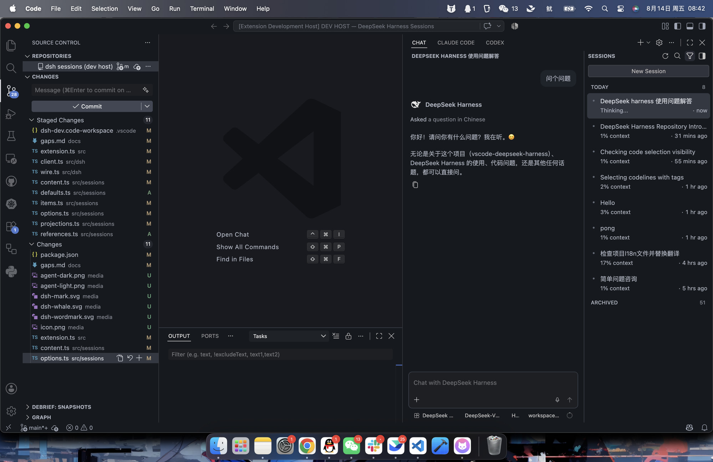

# vscode-deepseek-harness

一个非官方 VS Code 扩展，将 [DeepSeek Harness](https://github.com/deepseek-ai/deepseek-harness) 注册为 VS Code 原生 agent sessions 视图中的 **chat session target** —— 与 Claude Code 和 Codex 使用相同的界面 —— 而不是再提供一个 webview 聊天面板。

状态：**M0–M5 已实现。** VSIX 可以构建、安装并在授予 proposed APIs 后正常激活。



- [docs/plans/0001-vscode-chat-session-provider.md](docs/plans/0001-vscode-chat-session-provider.md) —— 架构决策、API 映射与里程碑。
- [docs/gaps.md](docs/gaps.md) —— chat UI 想要什么、`/api` 无法提供什么，以及最终做了什么替代。

## 使用

**dsh 在 Copilot 所在的同一个 chat panel 中回答。** 没有第二个侧边栏，也没有 webview：上方的面板是 VS Code 自带的，其中的回复来自这台机器上的 `dsh`。

由哪个 agent 回答由 composer 底部的一个选择器决定，默认安装下显示 **Local**。点击它并选择 **DeepSeek Harness** —— 此后你在该聊天中输入的所有内容都会发送给你的 harness。这个 chip 会一直保留直到你更改它，因此这是一个按会话（per-conversation）的选择，而不是一种模式。

一旦切换到它，composer 就是普通的那一个，这里值得关注的几个部分是：

| composer 中的内容 | 到达 dsh 的内容 |
|---|---|
| 你的编辑器选区，以 chip 形式固定 | 文件、行范围，以及选中的行本身 |
| 拖入的文件，或 `#` 引用的文件 | 它的路径，相对于会话的工作目录 |
| 粘贴的图片 | 真实的图片附件（当模型接受时） |
| **Model** 选择器 | `session.selectModel` —— 你的 dsh 提供的每一个 provider 和 model |
| **Reasoning** 选择器 | 所选模型的 efforts，带该模型自身的默认值 |
| **Permissions** 选择器 | `read-only` / `workspace-write` / `danger-full-access`，你的 dsh 的 preset 表里有什么就提供什么 |

选区以文本形式发送，因为 dsh 没有结构化的引用类型；已保存的文件以路径形式发送，因为 dsh 有自己的读取工具，更愿意自己打开文件而不是被传入内容。这两个决定及其代价都在 [gaps §10](docs/gaps.md) 中说明。

右侧的 **SESSIONS** 列表是你的真实 dsh session 历史 —— 与 `dsh` web UI 显示的是同一批会话，因为它们是同一个 harness。打开一个会话会重建其 transcript；**New Session** 会在你的 workspace 文件夹中开启一个新会话。

## 它做什么

| | |
|---|---|
| Sessions 列表 | 你的真实 dsh 会话，实时更新：新增、移除、运行中以及等待你处理的状态 |
| Transcript | 从 session log 重建的过往 turn，带 tool cards |
| 实时 turn | 散文、推理和 tool calls 实时流式输出 |
| 问题 | 在聊天中内联回答，像 dsh 的 `ask()` 一样精确地阻塞 |
| Approvals | 同样，以 *Allow once* / *Reject* 提示的形式 |
| Attachments | 你的选区及其行范围、拖入的文件、`#` 引用、粘贴的图片 |
| Model 切换 | 你的 dsh 提供的每一个 provider 和 model，按会话实时读取 |
| Thinking effort | 所选模型的 reasoning efforts，带其自身默认值 |
| Permissions | 会话的 preset，通过 dsh 自己的 `/permission` 命令切换 |
| Token 用量 | 每 turn 的 prompt 与 completion，含 cache 读写拆分 |
| Context | 每个会话行上模型窗口的百分比 |
| Control | 停止、从所选 turn fork、在你的 workspace 文件夹中新建会话 |

上表中没有任何硬编码。Providers、models、reasoning efforts、标题、token 计数和 context 容量都从运行中的 harness 读取，因此你的 dsh 明天新增的模型无需在此更新即可出现。

## 与上游的关系

DeepSeek Harness 不接受外部 pull request，因此本项目位于该仓库之外，并通过其现有的 `/api` carrier 与之通信 —— 与其自己的 web UI 使用的 HTTP + WebSocket 接口相同。没有 fork，没有 patch。

**此扩展永远不会捆绑 dsh。** 它驱动你已经安装的 `dsh`，使用你真实的 `$DSH_HOME`，因此你的 profiles、settings、credentials、skills 和 session history 都是你已有的那些。整个 VSIX 只有 42 KB：一个打包的 JavaScript 文件、一个 manifest 和图形资源。

它也从不要求你的 API key。Credentials 留在 dsh 自己的 credentials plane 中，即你已经存放它们的地方 —— 它们永远不会被复制到 VS Code settings 中。

## 要求

- VS Code **1.133.0** 或更高版本。
- 你自己安装的 DeepSeek Harness：`PATH` 上的 `dsh`，或已构建的 checkout（见 settings）。
- 为此扩展启用 proposed APIs —— 见下文。

## 安装

此扩展**不在 Marketplace 上，也无法上架** —— 声明了 `enabledApiProposals` 的扩展在发布时会被拒绝。手动安装 VSIX 是唯一途径，下面的 proposal 选择不是可选项：没有它，contribution 会被静默跳过，任何地方都不会出现任何内容。

**1. 获取 VSIX。** 从 [Releases](https://github.com/kalynnka/vscode-deepseek-harness/releases) 下载 —— 每个 release 都附带从该确切 tag 构建的 `.vsix` —— 或者自己构建：

```sh
npm install
npm run build
npm run package        # → deepseek-harness-sessions-<version>.vsix
```

**2. 安装它。**

```sh
code --install-extension deepseek-harness-sessions-*.vsix
```

**3. 授予 proposed APIs** —— 见下一节 —— 然后重启 VS Code。不是 reload，而是 restart，因为 `argv.json` 只在启动时读取一次。

升级时，将较新的 VSIX 安装覆盖旧版本即可；`argv.json` 中的 grant 以扩展 id 为键，会保留下来。

## 启用 proposed APIs

此扩展使用 proposed APIs，无法通过 Marketplace 发布。你只需选择一次：

1. Command Palette → **Preferences: Configure Runtime Arguments**。
2. 将扩展 id 添加到 `enable-proposed-api`：

   ```jsonc
   {
     "enable-proposed-api": ["kalynnka.deepseek-harness-sessions"]
   }
   ```

3. 重启 VS Code。

你**不需要**在编辑器的内部 allowlist 上。VS Code 会先检查 `product.json` 的 allowlist，然后回退到 `enable-proposed-api` 中指定的任何内容，因此这条记录就是全部授权。

**Extension development mode 不是替代方案。** 在 stable 构建上，编辑器要求 `isExtensionDevelopment && quality !== 'stable'` 才会广泛授予 proposals，所以单独按 <kbd>F5</kbd> 什么也得不到。bundled launch configuration 正是为此而显式传递 `--enable-proposed-api`。

### 验证授权

`src/probe.ts` 针对你实际运行的构建来回答这个问题，这也是唯一能回答它的地方：

```sh
npm run build
touch .dsh-probe-request
code --user-data-dir ~/.dsh-probe-vscode \
     --extensions-dir ~/.dsh-probe-vscode-ext \
     --extensionDevelopmentPath "$PWD" \
     --enable-proposed-api kalynnka.deepseek-harness-sessions \
     --new-window
cat .dsh-probe-result.json
```

它会写入判定结果，然后退出它打开的窗口：

```json
{ "vscodeVersion": "1.133.0", "ok": true, "missing": [] }
```

将 user-data-dir 放在你的 home 目录下；在 macOS 上，VS Code 不会针对 `/private/tmp` 下的目录启动。

每次 VS Code 升级后重新运行它 —— 被定稿或撤回的 proposal 会在此显示为 `ok: false` 并点名缺失的具体成员，而不是一个没有任何错误提示的空会话列表。

probe 会**调用** proposed 函数，而不是仅仅检查它是否存在。这个区别就是全部测试：VS Code 无条件导出 proposed 类和命名空间函数，只在调用时拒绝，因此存在性检查即使 proposal 已被拒绝也会报告成功。在 1.133.0 上测得：

| | 无 flag | `--enable-proposed-api <id>` |
|---|---|---|
| `--extensionDevelopmentPath` | denied | granted |
| installed VSIX | denied | granted |

## 故障排查

**任何地方都没有 DeepSeek Harness 条目。** `chatSessions` contribution 本身受 proposal 门控 —— 缺少授权时 VS Code 会静默跳过它，任何地方都没有错误。检查 `argv.json`，然后重新运行上面的 probe。

**没有与 Claude Code 和 Codex 并排的 DeepSeek Harness *tab*。** 这是预期行为，且无法从这里修复：那个 tab 条来自编译进 VS Code 的一个封闭的 session types allowlist，第三方类型被构造性地排除。第三方 session provider 会以 agent 的身份出现在 Chat composer 中 —— "Chat with DeepSeek Harness"。见 [gaps §9](docs/gaps.md)。

**启动会话。** Command Palette → **New DeepSeek Harness Session**，或 chat 头部的 `+ ⌄` 下拉菜单。在普通 **CHAT** tab 中输入*不会*到达 dsh —— 那个 tab 属于本地 agent，在那里发送的消息由当前选中的 agent 回答（默认安装下是 Copilot）。

这些命令之所以存在，只是因为 contribution 设置了 `canDelegate: true`。VS Code 的 `_enableContribution` **仅**在该 flag 设置时才注册 session agent 和按类型的 `New … Session` 命令；没有它，session type 会被注册但完全不可达，且没有任何错误来解释这一点。

**Sessions 列表。** `"chat.viewSessions.enabled": true` 显示它；**Chat Agent Sessions: Focus Agent Sessions** 聚焦它。注意 **Chat: Show Sessions** *不是* Command Palette 命令 —— 它只存在于 Chat welcome 视图的 context menu 中 —— 而 `chat.viewSessions.enabled` 为 false 时，Focus 命令会从 palette 中隐藏。

**日志中出现 "No dsh found"。** `deepseekHarness.executable` 和 `deepseekHarness.checkoutPath` 是 `machine` 作用域的，因此 VS Code **只从 User settings** 读取它们 —— workspace 或 folder settings 中的值会被刻意忽略，因为仓库不能把扩展指向任意二进制文件。

## Settings

| Setting | 默认值 | 用途 |
|---|---|---|
| `deepseekHarness.executable` | `""` | 当 `dsh` 不在 `PATH` 上时指定你的 `dsh` |
| `deepseekHarness.checkoutPath` | `""` | 已构建的 deepseek-harness checkout，通过 `node` 运行 |
| `deepseekHarness.home` | `""` | 覆盖 `$DSH_HOME`；为空表示使用你真实的那一个 |
| `deepseekHarness.historyPageMessages` | `10` | 每个会话加载的历史消息数 —— 刻意保持较小，见 [gaps §1](docs/gaps.md) |
| `deepseekHarness.extraArgs` | `[]` | 传给 `dsh web` 的额外参数 |

bind host 和 port 刻意不可配置。dsh web server 没有 TLS 也没有 auth，因此它总是在 loopback 上用临时端口启动，作为此扩展拥有并在退出时杀掉的子进程。

## 开发

```sh
npm install
npm run build       # 或：npm run watch
npm run typecheck
npm run smoke       # 只读：启动你的 dsh，读取 list/history/models，不写入任何内容
```

如果 `dsh` 不在你的 `PATH` 上，`npm run smoke` 需要设置 `DSH_CHECKOUT` 或 `DSH_EXECUTABLE`。

然后按 <kbd>F5</kbd>（**Run Extension**），它会启动一个已经设置好 proposal flag 的 Extension Development Host。

提交遵循 [Conventional Commits](https://www.conventionalcommits.org/)；PR 标题是 release-please 读取的内容，因为 squash merge 会保留标题而丢弃分支的 commit subjects。

## 非官方声明

这不是 DeepSeek 的项目。它不是由 DeepSeek 或 DeepSeek Harness 维护者构建、背书、审查或支持的，它的 bug 是**本**仓库的 bug —— 请不要把它们提交到上游。

DeepSeek Harness 不接受外部 pull request，这正是本项目作为独立扩展、通过其公开的 `/api` carrier 与 harness 通信而不是作为其 patch 存在的原因。

DeepSeek 名称和 whale 标志属于 DeepSeek。它们在此作为图标和显示名出现，以便 agent 能让人认出它所驱动的是哪个 harness，取自 [DeepSeek Harness 文档站点](https://deepseek-harness.github.io/deepseek-harness/)；来源在 [media/](media/) 中。不声称或暗示任何隶属或背书关系。如果 DeepSeek 不希望以这种方式使用它们，请开一个 issue，它们会被替换。

## 许可证

[MIT](LICENSE) —— 适用于本仓库中的代码。它不涉及 DeepSeek Harness 本身（后者有自己单独的许可证），也不涉及上面的标志。
